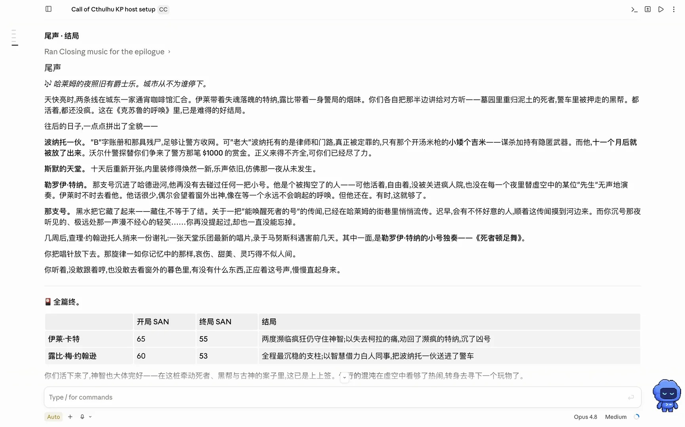
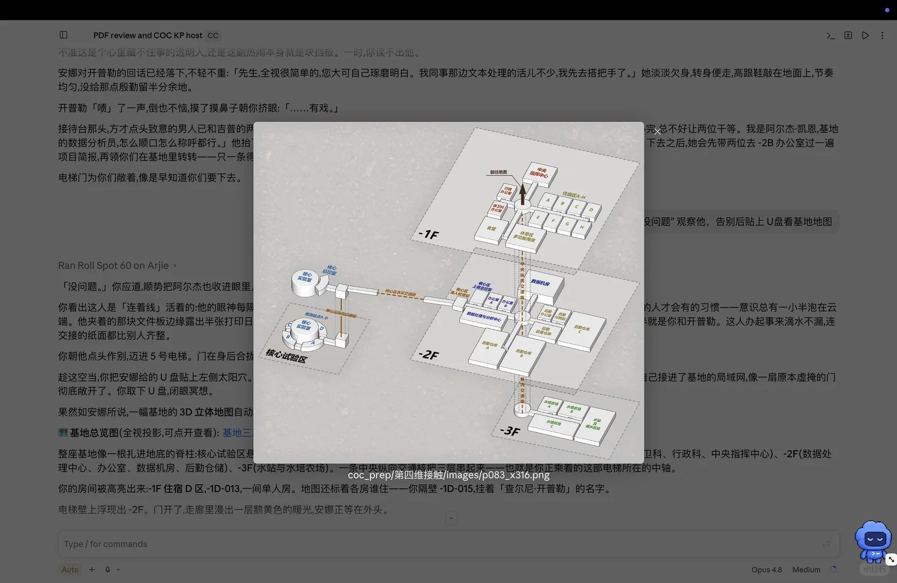

# COC KP Host

English version: [README.en.md](README.en.md)

一个中文 Call of Cthulhu 风格跑团 KP skill，可用于 Claude Code、Codex 和 ChatGPT。它让模型像守秘人一样主持调查恐怖短团或长团：开团简报、预设调查员卡、NPC 队友、检定与投骰、模组备团、玩家可见讲义展示、场景音乐，以及跨会话连续性记录。



## 适合做什么

- 开一个中文 COC 风格短团，让模型担任 KP
- 上传 PDF/DOCX 模组后，让 KP 私下备团并按 canon 推进
- 自动生成可玩的预设调查员与 NPC 队友
- 在剧情中展示玩家真正能看到的图片、地图、剪报、信件和讲义
- 为不同场景配上音乐，并在恐怖揭示瞬间切到静音
- 记录线索、地点、时间、HP/SAN/幸运、NPC 态度和战报，方便下次继续

## 最新亮点

### 1. 更像真实桌面的中文 KP

默认使用简体中文，风格偏克制、沉浸、调查恐怖。它不会一上来列菜单，也不会把玩家推到 1/2/3 选项里，而是用短场景、NPC 反应、线索和压力把回合停在玩家自然可以行动的地方。

开新团时只问最少问题：

1. 你想自定义调查员，还是使用预设卡？
2. 你想带几个 NPC 队友？

如果你说“直接开始”，它会使用合理默认值开局。

### 2. 模组备团与防剧透处理

当你提供 PDF、DOCX、图片包或其他模组材料时，KP 会先做一轮私密备团：

- 提取或检查模组文本，建立守秘人用场景索引
- 整理主要地点、NPC、时间线、线索门、危险区和结局条件
- 区分玩家可见材料与 KP 专用信息
- 隐藏怪物数据、房间钥匙、未来事件、隐藏真相和解法路线
- 每次进入关键地点、NPC、线索或事件前，先回查模组原文，再进行叙事

它的目标不是公开总结模组，而是让 KP 心里有谱，玩家只看到角色真正能看到的内容。

### 3. 玩家可见图片与讲义

模组里如果有玩家可以看到的图片、地图、肖像、剪报、信件、符号或图表，KP 会在角色真正接触到它们的那一刻发出来。



文字讲义不会被机械地叫作“Handout 1”或“玩家材料 2”，而会被转成游戏内物件：

- “便笺上写着……”
- “剪报边缘已经发黄，标题下有几行字……”
- “档案页的打字字迹很淡……”
- “照片背面有一行铅笔字……”

如果一张图里混有 KP 专用信息，KP 会只裁切/重制安全部分，或改用描述，不直接暴露整张图。

### 4. 场景音乐控制

音乐不只是装饰。这个 skill 会把配乐当成可操作的桌面工具：备团时准备不同情绪的音乐 cue，跑团时根据场景状态播放、切换、静音或恢复，让声音服务节奏，而不是绑定某一个模组。

备团时会生成一张通用音乐提示表，例如：

| 场景情绪 | 配乐策略 |
| --- | --- |
| 入场 / 社交 | 明快、热闹、有年代感 |
| 现实调查 | 低沉、不安、可循环 |
| 仪式 / 哀悼 | 肃穆、缓慢、带压迫感 |
| 追逐 / 危机 | 急促、紧张、有推进感 |
| 恐怖揭示 | 直接静音，给玩家留出停顿 |

随附脚本：

```bash
python scripts/music.py play <url>     # 打开曲子并取消静音
python scripts/music.py switch <url>   # 切换曲子，不叠音
python scripts/music.py cut            # 瞬间静音
python scripts/music.py resume         # 恢复声音
python scripts/music.py stop           # 停止音乐并关闭当前音乐标签页
```

目前音乐控制主要面向 macOS。其它平台会降级为提示用户手动操作。README 不再使用单一模组风格的音乐示意图，因为这项能力更适合作为“播放 / 切换 / 静音 / 恢复”的通用工具说明。

### 5. NPC 队友、全 PC 控制与分队

默认模式下，NPC 队友不是提示机器，也不是 KP 的传声筒，而是会犯错、有偏见、有情绪、会自己检定的调查员。他们可以提供质感和技能覆盖，但不能替玩家解谜，也不能泄露 KP 专用信息。

也可以切换为“玩家操控全部 PC”：

- 玩家为所有 PC 发声和决策
- KP 负责场景、节奏、NPC 反应、骰子和聚光灯
- 每个回合点名当前轮到哪个 PC

skill 也支持分队。不同小组会有各自的地点、时间和线索，KP 在自然节点切换视角；除非角色在游戏内汇合交换情报，否则不会串线泄密。

### 6. COC 7e 风格检定与速查

内置 `scripts/roll.py`，用于常见投骰：

```bash
python scripts/roll.py check 55
python scripts/roll.py d100
python scripts/roll.py 1d6
python scripts/roll.py 1d4+2
python scripts/roll.py 2d6
```

支持：

- 普通 / 困难 / 极难成功
- 奖励骰与惩罚骰原则
- SAN 损失
- 孤注一掷
- 战斗、疯狂、对抗检定等规则密集场景的速查

默认不启用花费幸运，除非玩家明确要求。

### 7. 调查员卡与携带物审查

预设调查员会包含：

- 基本身份、年龄、职业、教育、居住地、故乡
- STR、CON、SIZ、DEX、APP、INT、POW、EDU、幸运
- HP、MP、SAN、移动、伤害加值/体格
- 10-14 个相关技能
- 信用评级与生活水平
- 关键携带物
- 外貌、成长背景、信念、重要之人/地点/物品、弱点或秘密
- 关键背景连接 ★

当玩家声称携带贵重、罕见、受限、违法或战斗相关物品时，KP 会按年代、来源、经济能力、合法性和角色职业进行合理性审查；不合理的物品不会白送，而会标为“需在剧情中获取”。

## 目录结构

```text
.
├── SKILL.md
├── agents/
│   └── openai.yaml
├── assets/
│   ├── demo-screenshot.jpg
│   ├── demo-screenshot.png
│   ├── handout-map-preview.jpg
│   ├── handout-screenshot.png
│   ├── icon.svg
├── references/
│   ├── carry_audit.md         # 携带物与购买合理性审查
│   ├── gameplay_style.md      # NPC 队友与信息流规则
│   ├── prep_persistence.md    # 持久化备团、讲义索引、音乐索引、战报
│   └── rules_reference.md     # COC 7e 风格规则速查
└── scripts/
    ├── music.py               # 场景音乐控制
    └── roll.py                # 投骰工具
```

## 安装

复制到对应宿主的 skills 目录：

```bash
# Claude Code
cp -R coc-kp-host ~/.claude/skills/coc-kp-host

# Codex
cp -R coc-kp-host ~/.codex/skills/coc-kp-host
```

安装或更新后，重启宿主应用，让 skill 被重新发现。

## 使用方式

最直接的方式是上传模组文件，然后输入：

```text
/coc-kp-host
```

也可以用自然语言说明你要跑这个团，例如：

```text
我上传了一个 COC 模组。请你用 coc-kp-host 当 KP，先私下备团，不要剧透。
我想用预设调查员，带 1 个 NPC 队友；玩家看到图片或讲义时再展示给我。
```

如果没有上传模组，也可以直接开原创短团：

```text
开一个 COC 短团，你当 KP。我用预设调查员，带 1 个 NPC 队友。
```

## 设计取向

这个 skill 追求的是“会控节奏的中文 KP”，而不是规则讲解器。它会尽量：

- 让玩家保有行动权
- 把失败变成后果，而不是偷偷改成成功
- 让 NPC 队友有性格但不抢解谜权
- 用图片和音乐服务沉浸，而不是剧透
- 每个场景都贴着模组 canon 推进
- 把长期团的状态记录下来，方便下次继续

## 当前状态

- 短团：已验证
- 完整模组：已端到端验证
- PDF/DOCX 模组备团：已支持
- 玩家可见图片/讲义：已支持
- 场景音乐：macOS 支持，其他平台降级提示
- COC 风格投骰：已支持
- 持久化日志：支持状态日志与近似逐字战报

## License

MIT. See [LICENSE](LICENSE).
