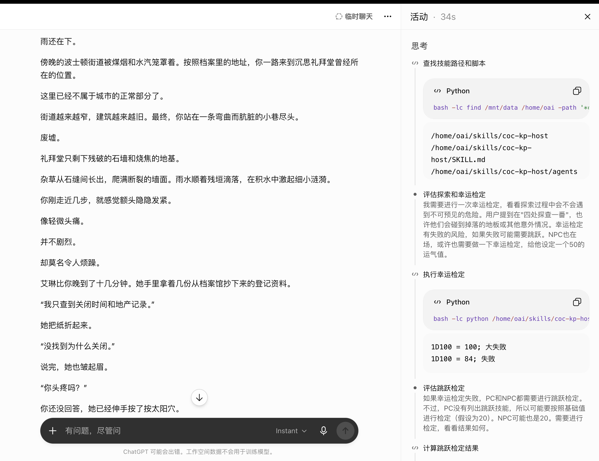
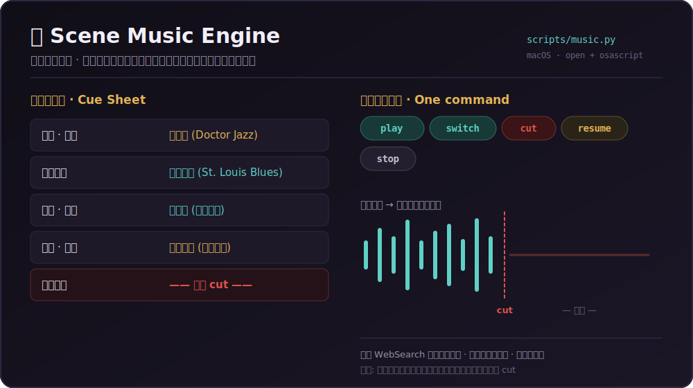
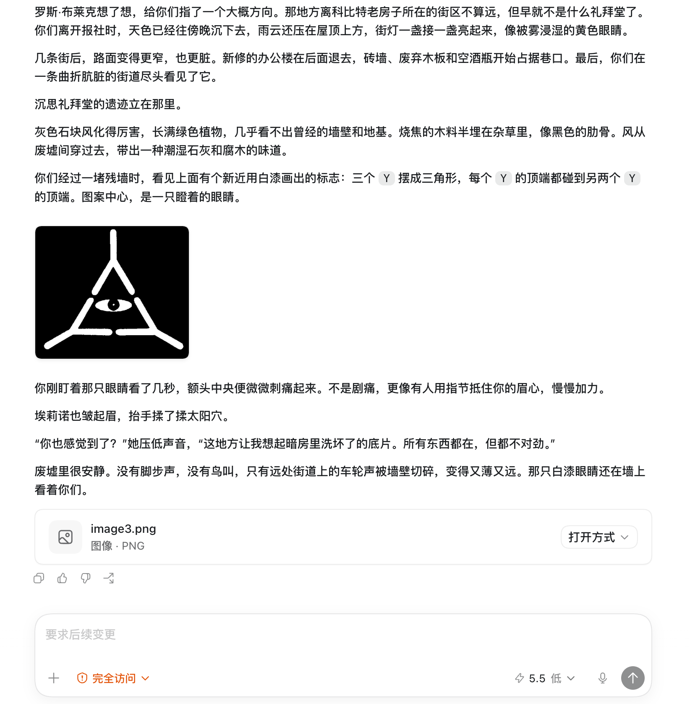

# COC KP Host



English documentation: [README.md](README.md)

COC KP Host 是一个中文跑团技能（可用于 Claude Code / Codex / ChatGPT），定位是让模型担任 Call of Cthulhu 风格调查恐怖短团或长团的 KP。它会处理开团简报、预设调查员卡、NPC 队友、检定与投骰，**为场景配上应景的音乐**，**在合适时机展示玩家可见图片与讲义**，并维护团内连续性记录。

目前短团与完整商业模组都已验证（例如入门套装《死者的顿足舞》）。

## 亮点

- 中文 COC 风格 KP 叙事，偏克制、沉浸、调查恐怖
- 开团只问最少问题：是否自定义调查员，以及需要几个 NPC 队友
- 自动生成完整预设调查员卡：属性、HP/MP/SAN/幸运/移动、技能、携带物、性格钩子与弱点
- 🎵 **场景音乐引擎**——在关键节点播放、切换、并在恐怖降临瞬间**掐断**应景配乐 *(新)*
- 🖼️ **玩家可见图片/讲义**——自动从上传的 PDF/DOCX 抽取插图，只在剧情中展示安全的那些 *(增强)*
- 🎭 **可配置控制模式**——可让玩家操控**全部 PC**，KP 专注节奏与聚光灯，并完整支持**分队** *(新)*
- 内置投骰脚本，支持 d100 检定和常见伤害、SAN、随机表骰
- 默认不列选项菜单，让玩家自然行动和对话
- 维护团内连续性：地点、时间、线索、开放路线、HP/SAN/幸运/弹药、NPC 态度

## 🎵 场景音乐（新）



当背景以音乐为重要主题——20 年代爵士、被诅咒的唱片、送葬赞歌——KP 会把它当作**场景里的活元素**来用，而非点缀。

备团阶段，KP 会建一张小小的**音乐提示表**，把每种场景情绪映射到一首现成可放的曲子：

| 场景情绪 | 示例曲目 |
| --- | --- |
| 入场 / 社交 | 欢快的热爵士 |
| 现实调查 | 低回的蓝调 |
| 葬礼 / 仪式 | 新奥尔良送葬调（可循环歌单）|
| 恐怖揭示 | —— 静音 —— |

开打时由 `scripts/music.py` 驱动播放，并且——最关键的——**在恐怖降临的瞬间掐断音乐**。揭示那一刻的寂静，本身就是惊吓的一部分。

```bash
python scripts/music.py play <url>     # 打开曲子并取消静音（干净切换，不叠音）
python scripts/music.py switch <url>   # play 的别名
python scripts/music.py cut            # 瞬间静音一切（用在揭示那一刻）
python scripts/music.py resume         # 取消静音 / 继续同一首
python scripts/music.py stop           # 关掉音乐标签页并静音（场景之间）
```

原理：在默认浏览器里打开曲子，用系统输出静音作为唯一可靠的跨应用"掐音"手段，并记住上一首 URL，切歌时绝不叠加重音。**目前仅支持 macOS**（用 `osascript`/`open`）；其它平台会打印"该手动做什么"。循环垫底优先用长合辑或歌单链接。

> 模组级巧思：当某个模组让"欢快不停的音乐本身"成为恐怖来源（比如乐队在谋杀中照样欢奏），KP 会让它继续放，只在诡异揭示的那一刻才掐断。

## 🖼️ 玩家可见讲义与图片

当模组里有适合玩家看到的资料时，KP 会**在调查员真正看到它的那一刻，直接把图片发到对话里**——线索符号、地图、肖像、剪报、信件、图表等讲义。



对上传的 **PDF/DOCX** 模组，KP 会在备团时抽取内嵌插图、建一份私密且防剧透的图片索引，只把玩家可见的部分拿出来；KP 专用地图、怪物数据、房间钥匙一律不露。文字讲义会被改写成游戏内实物（"便笺上写着……""剪报边缘已经发黄……"），而非机械标签。

## 🎭 控制模式与分队（新）

两种桌面风格，可中途切换：

- **AI 扮演队友（默认）**：NPC 同伴作为会犯错的调查员行动——有插科打诨、本能反应、自己的检定——但绝不替玩家解谜。
- **玩家操控全部 PC**：你为包括队友在内的每个 PC 发声和决策；KP 仍掌管场景框定、节奏、NPC 反应、骰子与**聚光灯**——叙述情境后，点名此刻轮到哪个 PC。

两种模式都支持**分队**：每条线各自成短场景，KP 来回切、分别记录各组的地点/时间/线索，在当面汇合前绝不串味。

## 目录结构

```text
.
├── SKILL.md
├── agents/
│   └── openai.yaml
├── assets/
│   ├── demo-screenshot.png
│   ├── handout-screenshot.png
│   └── icon.svg
├── references/
│   ├── gameplay_style.md      # NPC 队友与信息流规则
│   ├── prep_persistence.md    # 持久化备团目录、角色卡、讲义/音乐索引、战报
│   ├── rules_reference.md     # COC 式判定速查
│   └── carry_audit.md         # 装备/携带物合理性审查
└── scripts/
    ├── roll.py                # 投骰
    └── music.py               # 场景音乐：play / switch / cut / resume / stop
```

## 安装

把本目录复制到 skills 目录：

```bash
# Claude Code
cp -R coc-kp-host ~/.claude/skills/coc-kp-host
# Codex
cp -R coc-kp-host ~/.codex/skills/coc-kp-host
```

安装后重启宿主应用，让新 skill 被重新发现。

## 使用方式

开一个新对话，用中文提出请求，例如：

```text
开一个 COC 短团，你当 KP。我用预设调查员，带 1 个 NPC 队友。
环境允许的话，请配上应景的音乐。
```

如果你上传模组 PDF/DOCX 或玩家可见资料，它会把这些作为 canon；当角色在剧情里看到对应资料时再展示安全的图片，并为每个场景配上应景音乐。KP 专用地图、怪物数据、隐藏真相和未来剧情不会暴露。

## 投骰工具

```bash
python scripts/roll.py check 55
python scripts/roll.py d100
python scripts/roll.py 1d6
python scripts/roll.py 1d4+2
python scripts/roll.py 2d6
```

示例输出：

```text
1D100 = 42; 普通成功
```

## 设计取向

这个 skill 更像一个会控节奏的中文 KP，而不是规则讲解器：把场景停在玩家可以自然行动的地方、默认不列 1/2/3 选项、失败不被偷偷改成成功、NPC 队友会犯错而非提示机器，并用声音与图像把玩家拉进场景——而不是剧透。

更细的 NPC 队友与信息流规则见 [references/gameplay_style.md](references/gameplay_style.md)；持久化备团目录、角色卡、讲义/音乐索引与战报见 [references/prep_persistence.md](references/prep_persistence.md)。

## 当前状态

- 短团：已验证，表现稳定
- 完整模组：已端到端验证（例如《死者的顿足舞》）
- 玩家可见图片/讲义：已支持
- 场景音乐：macOS 上经 `scripts/music.py` 支持（其它平台优雅降级）
- 工具调用与投骰：已通过 `scripts/roll.py` 验证

## 许可证

MIT，见 [LICENSE](LICENSE)。
